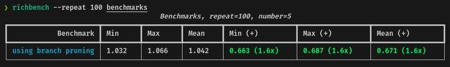
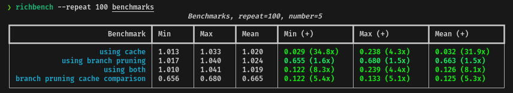

# Testing out some ideas to improve the Wagner-Fischer algorithm

I usually take dinner with something to watch, here it comes your video, really
interesting and I personally wanted to test out some ideas on how to improve it.
More than a pull request, this is an abstract on my journey testing out a couple
of ideas based in the base code:

## 1. Cache System

So the first idea is very simple: what if we use a `cache` system, to store all
the distances we are calculating so there is no repetition and reuse the
function calls?

```python
cache = {}

def wagner_fischer_dict(s1, s2):
    len_s1, len_s2 = len(s1), len(s2)
    if len_s1 > len_s2:
        s1, s2 = s2, s1
        len_s1, len_s2 = len_s2, len_s1

    # Check if the distance is already calculated
    if (s1, s2) in cache:
        return cache[(s1, s2)]

    current_row = range(len_s1 + 1)
    for i in range(1, len_s2 + 1):
        previous_row, current_row = current_row, [i] + [0] * len_s1
        for j in range(1, len_s1 + 1):
            add, delete, change = previous_row[j] + \
                1, current_row[j-1] + 1, previous_row[j-1]
            if s1[j-1] != s2[i-1]:
                change += 1
            current_row[j] = min(add, delete, change)

    # Store the distance in the cache
    cache[(s1, s2)] = current_row[len_s1]
    return current_row[len_s1]
```

Using the `richbench` tool, I've tested the performance of the cache system
against the base code, these are the results:


In average, using the cache system, the performance will be almost 29x
times faster, which makes sense. However, I will not call this a win, because
there is a trade-off: the memory usage, depending on the input, can be
considerable and in case of a large input this can be a problem.

## 2. Branch Pruning

The second approach is taken from an article of [`Fujimoto Seiji`](@fujimotos)
called `Can We Optimize the Wagner-Fischer Algorithm?` where he proposes a
couple of ideas to improve the Wagner-Fischer algorithm, for example, using a
one-dimensional array instead of a two-dimensional array which is already
implemented in the base code.

The technique is called `Ukkonen’s optimization` and it's based on the idea of
cutting off branches using upper bounds. The idea is to stop the computation of
a row if the minimum possible distance is greater than the threshold.

```python
def wagner_fischer_branch(s1, s2):
    len_s1, len_s2 = len(s1), len(s2)
    if len_s1 > len_s2:
        s1, s2 = s2, s1
        len_s1, len_s2 = len_s2, len_s1

    if len_s2 == 0:
        return len_s1
    if len_s2 == 1:
        return len_s1 - (s2[0] in s1)
    if len_s2 == 2:
        p1 = s1.find(s2[0])
        if p1 != -1:
            return len_s1 - (s2[1] in s1[p1+1:]) - 1
        else:
            return len_s1 - (s2[1] in s1[1:])

    buf = [i for i in range(len_s2 + 1)]

    Mx = (len_s2 - 1) // 2
    mx = 1 - Mx - (len_s1 - len_s2)

    for j in range(Mx + 1):
        buf[j] = j

    for i in range(1, len_s1 + 1):
        buf[0] = i - 1
        m = max(mx, 1)
        M = min(Mx, len_s2)
        mx += 1
        Mx += 1
        dia = buf[m - 1]
        top = buf[m]
        if s1[i - 1] != s2[m - 1]:
            dia = min(dia, top) + 1
        buf[m] = dia
        left = dia
        dia = top
        for j in range(m + 1, M + 1):
            top = buf[j]
            if s1[i - 1] != s2[j - 1]:
                dia = min(min(dia, top), left) + 1
            buf[j] = dia
            left = dia
            dia = top
        if len_s2 == M:
            continue
        if s1[i - 1] != s2[M]:
            dia = min(dia, left) + 1
        buf[M + 1] = dia
    dia = buf[len_s2]
    return dia
```

Testing the performance of the branch pruning against the base code, these are
the results:



In average, using the branch pruning, the performance will be 1.6x times faster
for the current dataset.

## 3. Testing both approaches

Finally, I wanted to test both approaches together. My naive idea was to use the
same approach added in the base code, but using a different cache for
this method itself since we don't want to give any advantage in the performance test.

```python
# 3. Use the cache and branch pruning together

cache_for_branch = {}

def wagner_fischer_branch_cache(s1, s2):
    if (s1, s2) in cache_for_branch:
        return cache_for_branch[(s1, s2)]

    len_s1, len_s2 = len(s1), len(s2)
    if len_s1 > len_s2:
        s1, s2 = s2, s1
        len_s1, len_s2 = len_s2, len_s1

    if len_s2 == 0:
        return len_s1
    if len_s2 == 1:
        return len_s1 - (s2[0] in s1)
    if len_s2 == 2:
        p1 = s1.find(s2[0])
        if p1 != -1:
            return len_s1 - (s2[1] in s1[p1+1:]) - 1
        else:
            return len_s1 - (s2[1] in s1[1:])

    buf = [i for i in range(len_s2 + 1)]

    Mx = (len_s2 - 1) // 2
    mx = 1 - Mx - (len_s1 - len_s2)

    for j in range(Mx + 1):
        buf[j] = j

    for i in range(1, len_s1 + 1):
        buf[0] = i - 1
        m = max(mx, 1)
        M = min(Mx, len_s2)
        mx += 1
        Mx += 1
        dia = buf[m - 1]
        top = buf[m]
        if s1[i - 1] != s2[m - 1]:
            dia = min(dia, top) + 1
        buf[m] = dia
        left = dia
        dia = top
        for j in range(m + 1, M + 1):
            top = buf[j]
            if s1[i - 1] != s2[j - 1]:
                dia = min(min(dia, top), left) + 1
            buf[j] = dia
            left = dia
            dia = top
        if len_s2 == M:
            continue
        if s1[i - 1] != s2[M]:
            dia = min(dia, left) + 1
        buf[M + 1] = dia
    dia = buf[len_s2]
    cache_for_branch[(s1, s2)] = dia
    return dia
```

I tested the performance of the branch pruning with the cache system against the
base code and the branch pruning itself. Here are the final results:



In average, using the branch pruning with the cache system, the performance will
be up to `4.4x` times faster for the current dataset, which is great but not so
much.

We can also check that the cache system improves up to `5x` times the
performance of the branch pruning approach, but, as I said before, the memory
usage is something to be aware of.

## Some references

- [Algorithms for Approximate String Matching - Esko Ukkonen](https://www.sciencedirect.com/science/article/pii/S0019995885800462?ref=pdf_download&fr=RR-2&rr=8563b177b8d7d9bd)
- [Richbench - A little Python benchmarking
  tool](https://github.com/tonybaloney/rich-bench)
- [Can We Optimize the Wagner-Fischer
  Algorithm?](https://ceptord.net/wagner-fischer/index.html#how-to-reduce-computation-time)
- [How to Benchmark (Python) Code](https://switowski.com/blog/how-to-benchmark-python-code/)
